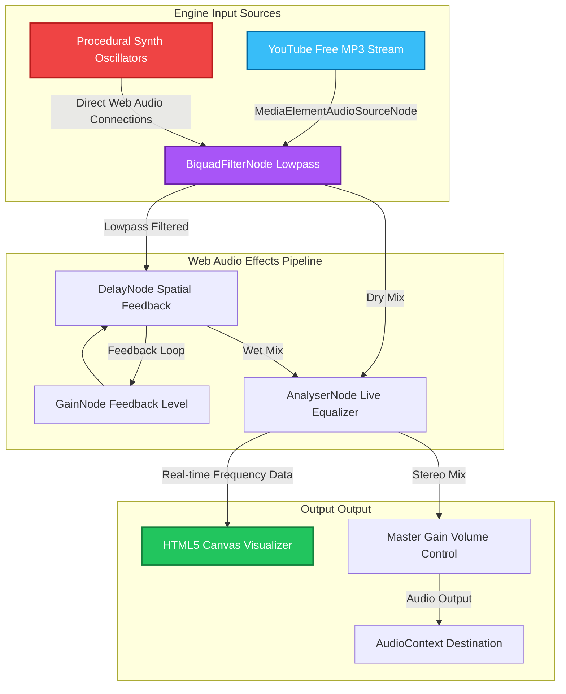

<div align="center">

# YAARLORE

### _Your friendships, narrated._

**The AI-powered friendship documentary. Spotify Wrapped for the trips you'll never forget.**

[](https://yaarlore.app)
[](https://nextjs.org)
[](https://anthropic.com)
[](https://supabase.com)

---

> _"Some products show you data. This one shows you who you really are."_

</div>

---

## What Is This?

You went on a trip. Someone started drama on Day 1. Someone claimed to be "fine" until 2 AM. There were three near-disasters and one conversation that will never be spoken of again.

**Yaarlore turns all of that into mythology.**

Upload your photo dump. The AI watches, judges, and documents. Out comes a cinematic, roasting, brutally honest **Friendship Lore Archive** — character archetypes, chaos scores, season recaps, and superlatives that will immediately end up in the group chat.

This is not a travel app. It's a **friendship documentary reconstructed from recovered memories.**

---

## Features

### The Lore Engine

Claude Sonnet 4 runs full behavioral analysis on your trip photos — not _what's_ in them, but _what they reveal._

| Output               | Description                                                   |
| -------------------- | ------------------------------------------------------------- |
| **Trip Title**       | A cinematic name worthy of an A24 poster                      |
| **Tagline**          | One sentence that captures the collective delusion            |
| **Cooked Score**     | 0–100 chaos rating. 84+ = historically cooked                 |
| **Cooked Verdict**   | "Zen Retreat" · "Certified Disaster" · "Institutionalized"    |
| **Season Recap**     | Full narrative of what _really_ happened                      |
| **Trip Eras**        | The phases your group went through, with timestamps           |
| **Character Cards**  | Every member's role title + chaos rating + defining moment    |
| **Superlatives**     | "Most likely to..." — assigned to the actual guilty person    |
| **Closing Line**     | The one sentence that defines the entire trip                 |
| **AI-Generated Art** | Trip cover, character portraits, era thumbnails via image gen |

The AI is instructed to think like an _"internet-native historian."_ It looks for who's carrying the group's social battery, who is pretending to be normal, and what the collective delusion was. Generic travel writing gets auto-rejected.

---

### Tap-Through Story Player

Every trip becomes a **cinematic tap-through experience** — like Instagram Stories but for your mythology.

- Progress bars showing exactly where you are
- Directional slide-in transitions (`←` retreat / `→` advance)
- Cooked score slams in and counts up from 0 with a visual shockwave
- Character cards flip in with a 3D perspective reveal
- Superlative winners slam in oversized coral text
- The closing verdict arrives cinematic, with teal dividers

---

### Public Story — No Login Required

Every trip gets a permanently shareable link that works for anyone:

```
/t/83A6AB6           →  Public teaser (title, score, tagline, stats)
/t/83A6AB6/story     →  Full tap-through story (no auth, full animations)
```

---

### Chaos Clash — Battle Mode

Two trips fight for supremacy. The community votes. The cooked score is the arena.

- Trips go head-to-head with live vote percentages
- AI judges the battle and delivers a verdict
- Vote bar animates in real time
- Anyone can vote — no account needed

---

### Year Wrap — `/wrap/[year]`

A Spotify Wrapped-style annual review of your entire year of trips.

- Chaos bar per trip with animated fill
- Highest cooked trip of the year
- Cross-trip behavioral patterns surfaced by the AI
- Shareable cinematic summary slide

---

### Physical Print Orders

Your lore as a hardcover book, delivered pan-India.

- Hardcover, 20–40 pages, AI-designed layout
- Every era gets its own spread
- Character cards and receipt page printed inside
- Join the waitlist from any trip page

---

### Upgrade Tiers — Razorpay

- **Digital** — unlocks full AI image generation (portraits, covers, era art)
- **Print** — physical book + digital bundle

---

### Emoji Reactions

On the final verdict slide, anyone can react — no account needed.

```
🔥  😂  💔  👑  😭
```

Optimistic update — feels instant, syncs in background. Counts are visible to everyone.

---

### Anniversary Emails — One Year Later

A year after lore drops, everyone on the trip gets a cinematic email:

```
ONE YEAR ANNIVERSARY

  The Solo Kodai Chronicles — Season 2025
           Cooked Score: 15
           ZEN RETREAT

"One year ago, you and your crew created friendship mythology."

          RELIVE THE STORY →
```

Auto-scheduled via SQL trigger the moment lore generation completes. Sent at 6am UTC via Vercel Cron + Resend. No manual setup — it just works.

---

### Nostalgia Engine

- **Today's Moments** — surfaces trips from the same date in past years
- **Memory Echo** — finds semantically similar photos across trips using vector embeddings
- Anniversary emails are seeded by this engine

---

### Public Profiles — `/u/[username]`

Every user gets a public profile showing their trip archive and cross-trip chaos sparklines.

---

### Auth — No Passwords, No Friction

Email OTP. You enter, you're in.

```
Enter email  →  Get 8-digit code  →  Enter code  →  You're home
```

- Delivered via Resend
- HMAC-SHA256 hashed before storage
- Rate limited (5 attempts / 15 min)
- Anti-spam middleware blocks abuse patterns
- Profile auto-created on first login

---

## Design System

Three distinct visual zones:

| Zone              | Feel                                                                        |
| ----------------- | --------------------------------------------------------------------------- |
| **Landing**       | Light cream + dot grid default. Dark mode toggle unleashes particle canvas. |
| **Auth**          | Dr. Strange portal rings. A golden snitch bouncing across screen edges.     |
| **Trip Interior** | Dark `#060604` base. Film grain. Cinematic documentary shell.               |
| **Story Player**  | Full-screen. Progress bars. Directional transitions. Pure cinema.           |

**Design tokens:**

- Fonts: **Bricolage Grotesque** (display) · **Nunito** (UI) · **Fira Mono** (data)
- OKLCH color system — perceptually uniform, warm-tinted neutrals
- Accent: `oklch(60% 0.22 25)` (coral-red) · Teal · Amber

---

## Tech Stack

```
FRONTEND
  Next.js 16 (App Router + Turbopack) · React 19
  tRPC v11 · TanStack Query v5
  Tailwind CSS · OKLCH color tokens
  Canvas API particle systems · CSS keyframe animations
  Bricolage Grotesque · Nunito · Fira Mono (Google Fonts)

BACKEND
  Supabase PostgreSQL + Storage + Auth + RLS
  Next.js API Routes (reactions, cron, OG cards, payments)
  tRPC routers (trips, photos, reactions, cards, battles, archetypes)
  Resend (OTP + anniversary emails)
  Razorpay (payments)
  Langfuse (AI pipeline observability)

AI WORKER  (Python 3.12 + FastAPI — deployed on Render)
  AsyncAnthropic (Claude Sonnet 4.6 · vision + text)
  3-phase production pipeline (observability · reliability · quality)
  LoreEvaluator — Haiku-based 5-dimension quality scoring
  Photo embeddings — cosine similarity for nostalgia engine
  Image generation — trip covers, character portraits, era thumbnails
  Durable background jobs via Supabase background_jobs table

INFRASTRUCTURE
  Vercel (frontend + serverless API)
  Vercel Cron (0 6 * * * — anniversary emails)
  Supabase SQL triggers (auto-schedule anniversary on lore ready)
  Render (AI worker, always-on Docker)
```

---

## Project Structure

```
src/
├── app/
│   ├── page.tsx                        # Landing — light/dark cinematic
│   ├── (auth)/login/                   # Email OTP (portal + snitch animation)
│   ├── trips/
│   │   ├── page.tsx                    # Trip list with chaos sparklines
│   │   ├── new/                        # Create a trip
│   │   ├── join/                       # Join via invite code
│   │   └── [tripId]/
│   │       ├── page.tsx                # Trip room (photos, generate)
│   │       ├── generating/             # Particle universe while AI runs
│   │       ├── story/                  # Private tap-through story
│   │       ├── invite/                 # 8-char invite code display
│   │       ├── card/                   # OG card generation
│   │       ├── upgrade/                # Razorpay upgrade tiers
│   │       └── print-order/            # Physical book waitlist
│   ├── battles/[battleId]/             # Chaos Clash — head-to-head voting
│   ├── wrap/[year]/                    # Year wrap summary
│   ├── t/[code]/                       # Public teaser + story (no auth)
│   ├── u/[username]/                   # Public profile
│   └── api/
│       ├── auth/send-otp|verify-otp/   # OTP with rate limiting
│       ├── payments/create-order/      # Razorpay order creation
│       ├── reactions/                  # GET counts + POST (anon + auth)
│       ├── cron/anniversaries/         # Daily anniversary email job
│       ├── cron/stuck-jobs/            # Reset stuck pipelines
│       ├── print-waitlist/             # Print order submissions
│       └── card/[type]/[tripId]/       # OG image generation
│
├── components/
│   ├── cinematic/                      # Dark documentary interior system
│   │   ├── ArchiveRoom, Documentary, Hero, Frames, Artifacts, Orchestrator
│   ├── experience/
│   │   ├── CinematicLanding.tsx        # Landing — light/dark + particle canvas
│   │   ├── CinematicAuth.tsx           # Portal rings + golden snitch
│   │   ├── ParticleUniverse.tsx        # Canvas: 300 dust + stars + vortex
│   │   ├── ConfessionInput.tsx         # Pre-trip anonymous confessions
│   │   ├── LoreCapsules.tsx            # Memory time capsule UI
│   │   ├── ScratchReveal.tsx           # Scratch-card reveal effect
│   │   ├── ReactionBar.tsx             # 🔥😂💔👑😭 optimistic reactions
│   │   └── MoodSoundtrack.tsx
│   └── ui/atoms.tsx                    # CinematicText, AtmosphericBlob, FilmGrain

ai-worker/
└── src/
    ├── lore/
    │   ├── orchestrator.py             # 3-phase async pipeline (~1200 lines)
    │   ├── prompts.py                  # Claude system + user prompts
    │   └── validators.py               # Schema + quality validation
    ├── image_gen.py                    # Trip covers, portraits, era thumbnails
    ├── embeddings.py                   # Photo CLIP embeddings
    ├── nostalgia.py                    # Anniversary + memory echo engine
    ├── thumbnails.py                   # Photo thumbnail generation
    ├── clients.py                      # AsyncAnthropic + Supabase
    └── main.py                         # FastAPI app + background job pollers
```

---

## The AI Pipeline

Claude doesn't caption photos. It reads the room.

**3-phase production pipeline, ~45s end-to-end:**

### Phase 1 — Vision + Lore (8 stages)

```
1. VISION BATCHING
   Photos analyzed in batches of 10
   Extracts: chaos indicators, late-night ratio, who's performing vs documenting

2. SIGNAL AGGREGATION
   Cross-references all batches (16k char context guard)
   Outputs: social dynamic, dominant photographer, peak cooked moment

3. LORE GENERATION
   Title, tagline, cooked score, verdict, season recap, 3 trip eras
   Hinglish-native · A24-toned · internet-culture-aware

4. CHARACTER ROLES  (parallel per member)
   Role title, description, chaos rating, defining moment
   Types: Chaos Source · Black Cat · Golden Retriever · Main Character · NPC

5. SUPERLATIVES
   "Most likely to..." — assigned to actual members with evidence
   Winner IDs validated against real member UUIDs

6. COOKED SCORING
   Cross-validated against all behavioral signals
   0-25: Mildly Simmering · 26-50: Getting Cooked · 51-75: Fully Cooked
   76-90: Peak Delusion · 91-100: Historically Cooked

7. SCHEMA VALIDATION
   Rejects generic AI writing (blocked phrases: "unforgettable memories",
   "bonds that last", "magical experience", etc.)

8. PERSISTENCE
   Writes lore_json, sets lore_status='ready'
   SQL trigger fires → anniversary email auto-scheduled for 1 year later
```

### Phase 2 — Observability + Reliability

- **Trace IDs** — every pipeline run gets a UUID, stored in `lore_trace_id`
- **Per-step token tracking** — `generation_cost_by_step` JSONB in the `trips` table
- **Pipeline state checkpoints** — `lore_pipeline_state` JSONB for debugging
- **FailoverReason taxonomy** — errors classified as `rate_limit / overload / timeout / connection / content_policy`
- **Per-reason retry config** — rate limits wait 8s, overload 5s, timeout 3s, with exponential backoff
- **PipelineRateLimiter** — module-level semaphore (8 concurrent), shared across all instances
- **PipelineBudget** — hard 60k token ceiling checked pre-call, prevents runaway spend
- **Durable image generation** — `background_jobs` table replaces fire-and-forget tasks; survives worker restarts
- **Stuck pipeline recovery** — `reset_stuck_pipelines()` runs every 30 poll ticks (~30 min)

### Phase 3 — Quality Evaluation

- **LoreEvaluator** — Claude Haiku 4.5 scores every lore output on 5 dimensions: specificity, coherence, tone, differentiation, schema completeness
- **Quality gate** — lore scoring below 0.55 is automatically retried once with dimension-specific feedback injected into the prompt
- **`lore_eval_json`** stored per trip — scores, weakest dimension, feedback
- **`lore_needs_review`** flag set for human review queue

---

## Dynamic Sensory Soundtrack Engine & AI Similarity Framework

Yaarlore features an immersive, state-of-the-art **Spotify Feature Simulator & Dynamic Synthesizer Console** integrated inside [MoodSoundtrack.tsx](file:///c:/Users/bhune/Woh-wala-trip/src/components/experience/MoodSoundtrack.tsx) to deliver real-time visual-emotion-to-soundtrack mapping.

This system is built using a **Hybrid Procedural + Streamed Audio Engine** that routes client-side synth oscillators and professional MP3 streams from the YouTube Free Audio Library through the same high-fidelity Web Audio effects graph and canvas equalizer.

### 🔊 Hybrid Audio Routing Architecture

When a synthesized procedural track is active, the engine triggers custom Web Audio oscillators, LFO modulators, and arpeggios. When a streamed track is active, it spins up an HTML5 `Audio` tag, handles cross-origin policies for direct streaming, and routes the stream through the identical lowpass filters, delays, and frequency analyzers:



---

### 🎛️ Real-Time Spotify Audio Features Modulator

Users can toggle the **Spotify Features** console to simulate standard Spotify API metrics, which are mathematically mapped to direct physical parameters inside our Web Audio graph:

| Spotify Feature     | Target Parameter               | Effect Range & Mapping Mechanism                                                                                                                            |
| :------------------ | :----------------------------- | :---------------------------------------------------------------------------------------------------------------------------------------------------------- |
| **🎭 Valence**      | Chord Harmonies & Pitch Scales | High Valence ($\ge 50\%$) maps to warm Lydian / bright major frequencies. Low Valence ($< 50\%$) triggers darker minor / pentatonic keys.                   |
| **⚡ Energy**       | Biquad Filter Cutoff Frequency | Modulates a lowpass filter sweep between $180\text{Hz}$ (deep, underwater ambiance) and $1,980\text{Hz}$ (bright, cutting highs) via `setTargetAtTime`.     |
| **💃 Danceability** | Arpeggiator Clock Tempo        | Intersects with Energy to sweep arpeggiator clock tick rate timings down from $320\text{ms}$ (gentle pulses) to a driving $50\text{ms}$ (rave tempo).       |
| **🎤 Liveness**     | Spatial Delay Feedback Level   | Adjusts the feedback gain multiplier node between $15\%$ and $80\%$, expanding the acoustic space from dry room acoustics to monumental cave echo feedback. |

---

### 🧠 CLAP Zero-Shot Similarity Sensing Heuristic

To match user mood queries, Yaarlore uses a client-side emulation of the **Contrastive Language-Audio Pretraining (CLAP)** zero-shot classification system:

$$\text{Sim}(A, T) = \frac{E_A \cdot E_T}{\|E_A\| \|E_T\|}$$

1. **Natural Language Input**: The user inputs free text (e.g., _"A fast dramatic synth beat for racing moments"_).
2. **NLP Feature Extraction**: The prompt is processed across multi-keyword token mappings corresponding to semantic concepts like speed, brightness, density, and emotional weight.
3. **Cosine Similarity Matrix**: A similarity matrix is computed across all 8 hybrid tracks. The winner is marked with a `★ MATCH` badge in the UI and automatically triggered with a cinematic triumph chime.

---

## Database Schema

```sql
-- Core
trips            (id, name, destination, dates, invite_code, lore_json,
                  lore_status, chaos_score, created_by,
                  lore_trace_id, lore_pipeline_state,       -- observability
                  generation_cost_by_step, lore_error,      -- cost tracking
                  lore_eval_json, lore_needs_review,        -- quality
                  trip_cover_url, cover_style)              -- image gen

trip_members     (id, trip_id, user_id, role_title, role_description,
                  role_chaos_rating, character_portrait_url)

trip_photos      (id, trip_id, user_id, storage_path, thumbnail_path,
                  embedding vector(1536), embedding_status)

profiles         (id, email, display_name, referral_code, referred_by)

-- Features
lore_reactions   (id, trip_id, user_id [nullable], emoji, created_at)
scheduled_emails (id, trip_id, user_id, email_type, send_at, sent_at)
battles          (id, trip_a_id, trip_b_id, votes_a, votes_b, status, verdict)
background_jobs  (id, trip_id, job_type, status, claimed_at, completed_at)
print_waitlist   (id, trip_id, user_id, name, created_at)
referral_events  (id, referrer_id, referred_id, created_at)
otp_codes        (id, email, code_hash, attempts, created_at)
```

`lore_json` carries the full AI output as a single JSONB column — one write, forever queryable.

---

## Running Locally

### 1. Clone & Install

```bash
git clone https://github.com/bansalbhunesh/Woh-wala-trip
cd Woh-wala-trip
npm install
```

### 2. Environment Variables

Create `.env.local` (copy from `.env.local.example`):

```env
# Supabase
NEXT_PUBLIC_SUPABASE_URL=https://xxxxx.supabase.co
NEXT_PUBLIC_SUPABASE_ANON_KEY=eyJ...
SUPABASE_SERVICE_ROLE_KEY=eyJ...

# Email
RESEND_API_KEY=re_xxxxxxxxxxxx
RESEND_FROM_EMAIL=noreply@yourdomain.com

# AI Worker
AI_WORKER_URL=http://localhost:8000
AI_WORKER_SECRET=your-secret-here

# Payments (Razorpay)
RAZORPAY_KEY_ID=rzp_test_xxxx
RAZORPAY_KEY_SECRET=xxxx

# Site
NEXT_PUBLIC_SITE_URL=http://localhost:3000
CRON_SECRET=your-cron-secret
```

### 3. Run Migrations

In Supabase SQL Editor, run files from `supabase/migrations/` in numerical order.

### 4. Start the AI Worker

```bash
cd ai-worker
python -m venv venv && source venv/bin/activate  # Windows: venv\Scripts\activate
pip install -e .

# ai-worker/.env  (NEVER put these in root .env.local)
ANTHROPIC_API_KEY=sk-ant-...
SUPABASE_URL=https://xxxxx.supabase.co
SUPABASE_SERVICE_ROLE_KEY=eyJ...
AI_WORKER_SECRET=your-secret-here

uvicorn src.main:app --reload --port 8000
```

> The AI worker is a separate process. `ANTHROPIC_API_KEY` lives only in `ai-worker/.env`.

### 5. Run the App

```bash
npm run dev
```

Open `http://localhost:3000`

---

## Deploy

### Frontend → Vercel

```bash
npx vercel deploy --prod
```

Add all `.env.local` vars in Vercel → Settings → Environment Variables.

`vercel.json` already has the cron config:

```json
{ "crons": [{ "path": "/api/cron/anniversaries", "schedule": "0 6 * * *" }] }
```

### AI Worker → Render

1. New Web Service → connect repo
2. Root Directory: `ai-worker` · Runtime: Docker
3. Env vars: `ANTHROPIC_API_KEY`, `SUPABASE_URL`, `SUPABASE_SERVICE_ROLE_KEY`, `AI_WORKER_SECRET`
4. Set `AI_WORKER_URL=https://your-worker.onrender.com` in Vercel

---

## Want to Dig In?

| What                          | Where                                                  |
| ----------------------------- | ------------------------------------------------------ |
| Improve lore quality          | `ai-worker/src/lore/prompts.py`                        |
| Tune chaos scoring            | `ai-worker/src/lore/validators.py`                     |
| Adjust quality gate threshold | `ai-worker/src/lore/orchestrator.py` → `LoreEvaluator` |
| Change the design system      | `src/app/globals.css` + `tailwind.config.ts`           |
| Add a new card type           | `src/app/api/card/` + `src/lib/og/`                    |
| Trip room UI                  | `src/app/trips/[tripId]/page.tsx`                      |
| Story player                  | `src/app/trips/[tripId]/story/page.tsx`                |

---

## What's Next

- [ ] Google Photos integration — auto-import trip albums
- [ ] Push notifications — get notified the second lore drops
- [ ] Full friendship timeline — every trip, every era, in one archive
- [ ] Group confessions — anonymous pre-trip questions that feed the AI
- [ ] WhatsApp share card — one-tap share to group chat

---

<div align="center">

---

**Some trips deserve to be documented properly.**

_This is how._

---

[**Try it →**](https://yaarlore.app)

_Season 2026 · AI Friendship Archive · Built with chaos, documented with care_

</div>
