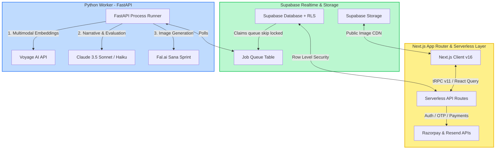

<div align="center">

# YAARLORE

### _Friendships, narrated. Memories, archived. Nostalgia, monetized._

**The collaborative AI documentary platform that turns chaotic group photo dumps into viral digital archives and physical coffee-table books.**

[](https://yaarlore.app)
[](https://nextjs.org)
[](https://anthropic.com)
[](https://supabase.com)

---

> _"In a world where millions of photos sit forgotten in cloud storage, Yaarlore converts passive digital media into active social capital."_

</div>

---

## 🚀 The One-Liner

Yaarlore is a collaborative storytelling platform where groups upload photo dumps, contribute anonymous confessions, and receive a cinematic, A24-style roasted "Friendship Lore Archive"—accessible as a web story and orderable as a high-quality physical hardcover book.

---

## ⚡ Why it Matters: The Opportunity & Market

1. **The Photo Dump Friction**: People take millions of photos on trips, but sorting, sharing, and reliving them is a high-friction process.
2. **Collaborative Storytelling**: Modern consumers crave interactive, shared digital experiences. Spotify Wrapped proved that personalized, data-backed nostalgia is one of the most viral formats on the internet.
3. **The Nostalgia Economy**: There is a high willingness to pay for physical keepsakes. By converting digital stories into immediate print-ready books, Yaarlore merges modern generative AI with high-margin physical printing and fulfillment.

---

## 📈 The Viral Growth Loop (Flywheel)

Yaarlore’s growth model is built directly into the product lifecycle:

```mermaid
flowchart TD
    A[Host creates Trip] -->|Generates 8-char Code| B[Friends Join without Signup]
    B -->|Upload Photos & Confessions| C[AI Generates Cinematic Story]
    C -->|Share cards to WhatsApp/Instagram| D[Public Teaser Viewers /t/:code]
    D -->|Click 'Create Your Trip'| A
    C -->|Upgrade Tier ($3 - $15)| E[High-Margin Print Orders]
```

1. **Host Creates a Trip**: Generates an 8-character invite code.
2. **Zero-Friction Co-creation**: Friends join using the code (no account creation required), drop photos, and submit anonymous "confessions" that provide context for the AI.
3. **Cinematic Story Generation**: Out comes a tap-through slide deck containing character archetypes, chaos scores, and superlatives.
4. **Organic Sharing**: Users share custom-generated Instagram/WhatsApp summary cards and public teaser links (`/t/:code`).
5. **The Loop Restarts**: Teaser viewers land on the teaser page, experience the product value, click "Create a Trip", and launch their own campaign.
6. **Monetization Event**: Group members order physical coffee-table books of their archive (Pan-India delivery via Razorpay checkout).

---

## 🛠️ System Architecture

Yaarlore is architected as a lightweight, modern web client supported by an async background processing worker:



---

## 💎 Product Features

### 1. The Multi-Modal Vision Lore Engine

Instead of just tagging or captioning images, the engine reads the social battery and behavioral dynamics of the group.

- **Vision Batching**: Photos are analyzed in context-rich batches to detect late-night ratios, chaos markers, and group energy.
- **Signal Aggregation**: Synthesizes vision reports and anonymous text confessions into a coherent narrative arc.
- **The Friendship Dossier**:
  - **Cooked Score**: A 0–100 rating calibrating the trip's absolute chaos.
  - **Season Recap**: A Hinglish-native, internet-culture-aware three-act story of the trip.
  - **Role Archetypes**: Individual character cards assigned to each member (e.g. _Chaos Source_, _Black Cat_, _Golden Retriever_, _NPC_).
  - **Superlatives**: Programmatic awards referencing actual events from the trip.

---

### 2. Immersive Tap-Through Story Player (`/t/:inviteCode/story`)

A custom, mobile-first cinematic presentation wrapper that brings the generated story to life:

- **Slide Physics**: Directional slide transitions that adapt based on tap location.
- **Score Sweeps**: The "Cooked Score" page initiates a visual rumble and counts up to the target score dynamically.
- **Realtime Reactions**: Watchers can react in real time using animated emojis (`🔥`, `😂`, `💔`, `👑`, `😭`). Updates use optimistic states and sync over Supabase.
- **Dynamic Audio Engine**: Integrated audio synthesis mapping story mood parameters directly to physical synthesizer filters and low-pass sweeps in the browser.

---

### 3. Chaos Clash (Competitive Arena)

Groups can pitch their trips against each other in head-to-head voting battles.

- **Live Arbitrator**: Claude evaluates the materials of both trips and writes a detailed judgment comparing their level of chaos.
- **Interactive Voting**: Instant, zero-friction community voting with live updating SVG percentage meters.

---

### 4. Spotify-Style Ambient Soundtrack Matcher

A client-side emulation of the **Contrastive Language-Audio Pretraining (CLAP)** framework inside [MoodSoundtrack.tsx](file:///c:/Users/bhune/Woh-wala-trip/src/components/experience/MoodSoundtrack.tsx):

$$\text{Sim}(Audio, Text) = \frac{E_{Audio} \cdot E_{Text}}{\|E_{Audio}\| \|E_{Text}\|}$$

Users type natural language queries (e.g. _"deep house for driving late at night"_), and the system matches the query to the best-suited soundscape from our hybrid synthesizer & YouTube Audio Library index.

---

### 5. Year Wrapped Retrospective (`/wrap/:year`)

A dynamic group retrospective compiling an entire year's worth of trips, behaviors, and chaos markers into a shareable film-strip deck.

---

## 🔒 Reliability, Security & Budget Controls

### 💸 Pipeline Cost Safeguards

- **PipelineBudget**: A strict 60k-token ceiling checked before API execution to prevent runaways.
- **Fal.ai Daily Budgets**: Hard daily budget caps stored in Supabase `fal_budget` to block API billing abuse.
- **Per-Trip Limits**: Strict daily generation rate limits per trip ID to prevent DDOS-style looping.

### 🛡️ Hardened Database Security

- **Supabase RLS Hardening**: All views are configured with `security_invoker = true` to guarantee that they respect underlying Row Level Security policies.
- **Anonymous Verification**: Non-authenticated users can view public teasers and react, but cannot access private member data or execute administrative mutations.
- **Passwordless OTP Salts**: OTP codes are hashed using `HMAC-SHA256` with server-only environment salts before database storage to secure user credentials.

### 🤖 Quality Gate Evaluation

- **LoreEvaluator**: A Claude Haiku engine scores every generated lore output on five dimensions: _specificity_, _coherence_, _tone_, _differentiation_, and _schema completeness_.
- **Auto-Correction Loop**: Outputs scoring below a 0.55 threshold are rejected and regenerated once, injecting the exact evaluation feedback back into the prompt.

---

## 📁 Repository Directory Structure

```text
src/
├── app/
│   ├── page.tsx                        # Landing — light/dark cinematic
│   ├── (auth)/login/                   # Email OTP (portal + snitch animation)
│   ├── trips/
│   │   ├── page.tsx                    # Trip list with chaos sparklines
│   │   ├── new/                        # Create a trip (strict date validator)
│   │   ├── join/                       # Join via invite code
│   │   └── [tripId]/
│   │       ├── page.tsx                # Trip room (photos, generate)
│   │       ├── generating/             # Realtime particle universe while AI runs
│   │       ├── story/                  # Private tap-through story
│   │       └── upgrade/                # Razorpay upgrade tiers
│   ├── battles/[battleId]/             # Chaos Clash — head-to-head voting
│   ├── wrap/[year]/                    # Year wrap summary
│   ├── t/[code]/                       # Public teaser + story (no-auth route)
│   └── u/[username]/                   # Public developer/adventurer profile
│
├── components/
│   ├── cinematic/                      # Dark documentary system components
│   ├── experience/
│   │   ├── CinematicLanding.tsx        # Landing Page particle systems
│   │   ├── ConfessionInput.tsx         # Anonymous pre-trip confession portal
│   │   ├── ScratchReveal.tsx           # Scratch-card reveal canvas
│   │   ├── ReactionBar.tsx             # 🔥😂💔👑😭 optimistic reactions
│   │   └── MoodSoundtrack.tsx          # Web Audio synth & CLAP mood matcher
│
├── server/
│   └── trpc/routers/
│       ├── trips.ts                    # Main trip router & status resetters
│       └── photos.ts                   # Upload URL signing & confirmation
│
ai-worker/
└── src/
    ├── lore/
    │   ├── orchestrator.py             # 3-phase async generation pipeline
    │   ├── prompts.py                  # Vision & narrative prompts
    │   └── validators.py               # Schema compliance & quality gate
    ├── image_gen.py                    # Fal.ai Sana Sprint cover & thumbnail generator
    ├── embeddings.py                   # Voyage AI multimodal embeddings extractor
    ├── clients.py                      # Shared Async client configurations
    └── main.py                         # FastAPI poller & background worker
```

---

## 🛠️ Developer Setup & Local Execution

### 1. Clone & Dependencies

```bash
git clone https://github.com/bansalbhunesh/Woh-wala-trip
cd Woh-wala-trip
npm install
```

### 2. Environment Configuration

Create `.env.local` in the root directory:

```env
# Supabase Configuration
NEXT_PUBLIC_SUPABASE_URL=https://your-project.supabase.co
NEXT_PUBLIC_SUPABASE_ANON_KEY=eyJ...
SUPABASE_SERVICE_ROLE_KEY=eyJ...

# Email Node (Resend)
RESEND_API_KEY=re_xxx
RESEND_FROM_EMAIL=noreply@yourdomain.com

# AI Worker Connection
AI_WORKER_URL=http://localhost:8000
AI_WORKER_SECRET=your_auth_secret_here

# Payment Provider (Razorpay)
RAZORPAY_KEY_ID=rzp_test_xxx
RAZORPAY_KEY_SECRET=xxx

# Site Constants
NEXT_PUBLIC_SITE_URL=http://localhost:3000
CRON_SECRET=your-cron-secret
```

### 3. Initialize SQL Migrations

Run the migration scripts located in `supabase/migrations/` in numerical order using the Supabase SQL editor.

### 4. Start the Python AI Worker

Create `ai-worker/.env` and start the FastAPI worker:

```bash
cd ai-worker
python -m venv venv
# Activate virtual environment
# Windows: venv\Scripts\activate | Unix: source venv/bin/activate
pip install -e .

# Configure ai-worker/.env
ANTHROPIC_API_KEY=sk-ant-xxx
SUPABASE_URL=https://your-project.supabase.co
SUPABASE_SERVICE_ROLE_KEY=eyJ...
AI_WORKER_SECRET=your_auth_secret_here

# Run worker reload server
uvicorn src.main:app --reload --port 8000
```

### 5. Launch the Next.js Dev Server

```bash
cd ..
npm run dev
```

Open [http://localhost:3000](http://localhost:3000) inside your browser.

---

## 🧪 Verification & Test Suite

### Frontend & API Integrity Tests

To execute all Next.js page renders, API contracts, and tRPC integration tests:

```bash
npm run test:unit
```

### AI Pipeline Deterministic Tests

To evaluate Vision batch inputs, schema parsing, quality gate limits, and budget limits in Python:

```bash
npm run test:ai:deterministic
```

---

<div align="center">

**Built with chaos, archived with care.**

_Yaarlore © 2026 · Engineered for Friendship Mythology._

</div>
