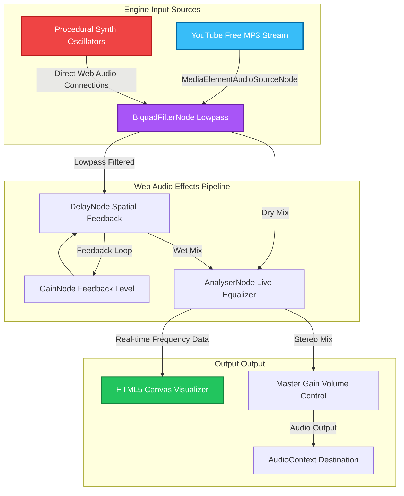

<div align="center">

# YAARLORE

### _Your friendships, narrated._

**The AI-powered friendship documentary. Spotify Wrapped for the trips you'll never forget.**

[](https://yaarlore.app)
[](https://nextjs.org)
[](https://anthropic.com)
[](https://supabase.com)

---

> _"Some products show you data. This one shows you who you really are."_

</div>

---

## What Is This?

You went on a trip. Someone started drama on Day 1. Someone claimed to be "fine" until 2 AM. There were three near-disasters and one conversation that will never be spoken of again.

**Yaarlore turns all of that into mythology.**

Upload your photo dump. The AI watches, judges, and documents. Out comes a cinematic, roasting, brutally honest **Friendship Lore Archive** — character archetypes, chaos scores, season recaps, and superlatives that will immediately end up in the group chat.

This is not a travel app. It's a **friendship documentary reconstructed from recovered memories.**

---

## Features

### 🧠 The Lore Engine

Claude Sonnet 4.6 runs full behavioral analysis on your trip photos — not _what's_ in them, but _what they reveal._

| Output               | Description                                                |
| :------------------- | :--------------------------------------------------------- |
| **Trip Title**       | A cinematic name worthy of an A24 poster                   |
| **Tagline**          | One sentence that captures the collective delusion         |
| **Cooked Score**     | 0–100 chaos rating. 84+ = historically cooked              |
| **Cooked Verdict**   | "Zen Retreat" · "Certified Disaster" · "Institutionalized" |
| **Season Recap**     | Full narrative of what _really_ happened                   |
| **Trip Eras**        | The phases your group went through, with timestamps        |
| **Character Cards**  | Every member's role title + chaos rating + defining moment |
| **Superlatives**     | "Most likely to..." — assigned to the actual guilty person |
| **Closing Line**     | The one sentence that defines the entire trip              |
| **AI-Generated Art** | Trip cover, character portraits, era thumbnails via fal.ai |

The AI is instructed to think like an _"internet-native historian."_ It looks for who's carrying the group's social battery, who is pretending to be normal, and what the collective delusion was. Generic travel writing gets auto-rejected.

---

### 📱 Tap-Through Story Player

Every trip becomes a **cinematic tap-through experience** — like Instagram Stories but for your mythology.

- Progress bars showing exactly where you are
- Directional slide-in transitions (`←` retreat / `→` advance)
- Cooked score slams in and counts up from 0 with a visual shockwave
- Character cards flip in with a 3D perspective reveal
- Superlative winners slam in oversized coral text
- The closing verdict arrives cinematic, with teal dividers

---

### 🌐 Public Gateways & Interactive Routing

Every trip archive, teaser, and profile is generated with unique, permanently shareable routing paths that require **no login** for visitors.

| Experience Endpoint                   | Visual Format          | Deep-Link Experience                                                                                          |
| :------------------------------------ | :--------------------- | :------------------------------------------------------------------------------------------------------------ |
| <kbd>**`/t/:inviteCode`**</kbd>       | **The Dossier Teaser** | High-fidelity briefing dashboard featuring the title, cooked score, group tagline, and core stats.            |
| <kbd>**`/t/:inviteCode/story`**</kbd> | **The Cinematic Reel** | Immersive, full-screen tap-through narrative utilizing directional slide physics and Web Audio track syncing. |
| <kbd>**`/wrap/:year`**</kbd>          | **The Retrospective**  | Spotify Wrapped-style annual group overview showcasing cumulative stats and year-wide behaviors.              |
| <kbd>**`/u/:username`**</kbd>         | **The Lore Profile**   | A sleek, high-contrast digital portfolio showing a user's complete trip index and chaos sparklines.           |

---

### ⚔️ Chaos Clash (Battle Mode)

Two trips enter. One leaves. The ultimate arena for friendship bragging rights.

> [!TIP]
> **Who is truly the most cooked?** Trips can be submitted to head-to-head public battles where the community decides the winner in real time.
>
> - 🗳️ **Zero-Friction Voting** — Open voting bars that animate dynamically with instantaneous client-side updates.
> - ⚖️ **The AI Arbitrator** — Claude acts as the arena judge, analyzing the photos and stories from both trips to deliver a hilarious, definitive verdict.
> - ⚡ **Live Stat Modulators** — Dynamic, real-time vote percentage sweeps that respond instantly to database changes.

---

### 🎞️ Year Wrap Retrospective · `[ /wrap/:year ]`

<kbd><b>Dynamic Spotify Wrapped for Friendships</b></kbd>

```text
┌──────────────────────────────────────────────────────────┐
│  YAARLORE WRAP 2026                                      │
├──────────────────────────────────────────────────────────┤
│  Collective Delusion: "We are definitely coming back"    │
│  Total Trips: 14  ·  Cooked Rating: 84% [Historically]   │
│                                                          │
│  [|||||||||||||||||||||||||||||||||||..........] 72%     │
│  Group Social Battery Trajectory (Q1-Q4)                 │
└──────────────────────────────────────────────────────────┘
```

An epic, cinematic retrospection that compiles an entire year of trips, chaos, and collective delusions into a single immersive walk down memory lane.

> [!IMPORTANT]
> **Your year in friendship mythology, analyzed.** The Wrap page runs aggregate models across all your trips for the year to build a premium interactive slide deck:
>
> - 📈 **Chaos Trajectory** — Interactive bar charts detailing the cooked rating over time, rendered with smooth SVG progress indicators.
> - 👑 **The Summit of Chaos** — Crown the single highest cooked trip of the year with visual trophy animations.
> - 🧠 **Long-Term Behavior Analysis** — Surfaces recurring behavioral patterns, chronic photo-dump offenders, and evolving group dynamics.
> - 🎞️ **Shareable Film Strip** — A mobile-responsive summary slide styled like an analogue film-negative frame, perfect for social sharing.

---

### 📕 Physical Hardcover Slambooks & Payments

Your lore as a hardcover book, delivered pan-India.

- **Direct Razorpay Checkout**: Upgrade to the print tier (₹799) directly in-app to order a physical book.
- **Automated Print Generation**: Successful checkout enqueues a `generate_slambook` background job in `slambook.py` using `fpdf2`.
- **High-Quality Layouts**: Automatically designs Cover spreads, dossier pages, 2-up spreads, and 3x3 moments grid using original high-resolution photo uploads ranked by engagement metrics.

---

### 💬 Group Confessions & WhatsApp Sharing

- **Anonymous Confessions**: Drop pre-trip anonymous confessions in the input panel before lore generation starts to feed juicy context into the AI pipeline.
- **WhatsApp Share Card**: Direct sharing capabilities generated automatically with AI captions, enabling one-tap forwarding of stories and trip invite links to your group chat.

---

### 🔔 Global Toast Notification System

- Unified, branded toast system using `ToastProvider` and a `useToast` hook for real-time feedback.
- Branded pill layout featuring GPU-accelerated spring animations (`toast-rise` keyframes) and safe-area auto-dismissal.

---

### 🛡️ Safety & Quality Controls

- **Date Boundary Enforcement**: Programmatically validates dates during trip creation to block future-dated entries.
- **Race Condition Prevention**: Employs UI lockouts (`canUpload`) to lock out additional image uploads once the Lore Engine starts processing.
- **Hardened Database Views**: Implements RLS compliant database views using `security_invoker = true` to strictly protect tables like `public_profiles` and `photo_view_stats`.
- **Quality Gates**: `LoreEvaluator` runs Claude Haiku quality scoring on 5 dimensions, auto-retrying low-confidence generations with specific feedback.

---

### ⚡ Dynamic Sensory Soundtrack Engine & AI Similarity Framework

Yaarlore features an immersive, state-of-the-art **Spotify Feature Simulator & Dynamic Synthesizer Console** integrated inside [MoodSoundtrack.tsx](file:///c:/Users/bhune/Woh-wala-trip/src/components/experience/MoodSoundtrack.tsx) to deliver real-time visual-emotion-to-soundtrack mapping.

This system is built using a **Hybrid Procedural + Streamed Audio Engine** that routes client-side synth oscillators and professional MP3 streams from the YouTube Free Audio Library through the same high-fidelity Web Audio effects graph and canvas equalizer.

#### 🔊 Hybrid Audio Routing Architecture

When a synthesized procedural track is active, the engine triggers custom Web Audio oscillators, LFO modulators, and arpeggios. When a streamed track is active, it spins up an HTML5 `Audio` tag, handles cross-origin policies for direct streaming, and routes the stream through the identical lowpass filters, delays, and frequency analyzers:



---

#### 🎛️ Real-Time Spotify Audio Features Modulator

Users can toggle the **Spotify Features** console to simulate standard Spotify API metrics, which are mathematically mapped to direct physical parameters inside our Web Audio graph:

| Spotify Feature     | Target Parameter               | Effect Range & Mapping Mechanism                                                                                                                            |
| :------------------ | :----------------------------- | :---------------------------------------------------------------------------------------------------------------------------------------------------------- |
| **🎭 Valence**      | Chord Harmonies & Pitch Scales | High Valence ($\ge 50\%$) maps to warm Lydian / bright major frequencies. Low Valence ($< 50\%$) triggers darker minor / pentatonic keys.                   |
| **⚡ Energy**       | Biquad Filter Cutoff Frequency | Modulates a lowpass filter sweep between $180\text{Hz}$ (deep, underwater ambiance) and $1,980\text{Hz}$ (bright, cutting highs) via `setTargetAtTime`.     |
| **💃 Danceability** | Arpeggiator Clock Tempo        | Intersects with Energy to sweep arpeggiator clock tick rate timings down from $320\text{ms}$ (gentle pulses) to a driving $50\text{ms}$ (rave tempo).       |
| **🎤 Liveness**     | Spatial Delay Feedback Level   | Adjusts the feedback gain multiplier node between $15\%$ and $80\%$, expanding the acoustic space from dry room acoustics to monumental cave echo feedback. |

---

#### 🧠 CLAP Zero-Shot Similarity Sensing Heuristic

To match user mood queries, Yaarlore uses a client-side emulation of the **Contrastive Language-Audio Pretraining (CLAP)** zero-shot classification system:

$$\text{Sim}(A, T) = \frac{E_A \cdot E_T}{\|E_A\| \|E_T\|}$$

1. **Natural Language Input**: The user inputs free text (e.g., _"A fast dramatic synth beat for racing moments"_).
2. **NLP Feature Extraction**: The prompt is processed across multi-keyword token mappings corresponding to semantic concepts like speed, brightness, density, and emotional weight.
3. **Cosine Similarity Matrix**: A similarity matrix is computed across all 8 hybrid tracks. The winner is marked with a `★ MATCH` badge in the UI and automatically triggered with a cinematic triumph chime.

---

## Database Schema

```sql
-- Core
trips            (id, name, destination, dates, invite_code, lore_json,
                  lore_status, chaos_score, created_by,
                  lore_trace_id, lore_pipeline_state,       -- observability
                  generation_cost_by_step, lore_error,      -- cost tracking
                  lore_eval_json, lore_needs_review,        -- quality
                  trip_cover_url, cover_style)              -- image gen

trip_members     (id, trip_id, user_id, role_title, role_description,
                  role_chaos_rating, character_portrait_url)

trip_photos      (id, trip_id, user_id, storage_path, thumbnail_path,
                  embedding vector(1536), embedding_status)

profiles         (id, email, display_name, referral_code, referred_by)

-- Features
lore_reactions   (id, trip_id, user_id [nullable], emoji, created_at)
scheduled_emails (id, trip_id, user_id, email_type, send_at, sent_at)
battles          (id, trip_a_id, trip_b_id, votes_a, votes_b, status, verdict)
background_jobs  (id, trip_id, job_type, status, claimed_at, completed_at)
print_waitlist   (id, trip_id, user_id, name, created_at)
referral_events  (id, referrer_id, referred_id, created_at)
otp_codes        (id, email, code_hash, attempts, created_at)
```

`lore_json` carries the full AI output as a single JSONB column — one write, forever queryable.

---

## Running Locally

### 1. Clone & Install

```bash
git clone https://github.com/bansalbhunesh/Woh-wala-trip
cd Woh-wala-trip
npm install
```

### 2. Environment Variables

Create `.env.local` (copy from `.env.local.example`):

```env
# Supabase
NEXT_PUBLIC_SUPABASE_URL=https://xxxxx.supabase.co
NEXT_PUBLIC_SUPABASE_ANON_KEY=eyJ...
SUPABASE_SERVICE_ROLE_KEY=eyJ...

# Email
RESEND_API_KEY=re_xxxxxxxxxxxx
RESEND_FROM_EMAIL=noreply@yourdomain.com

# AI Worker
AI_WORKER_URL=http://localhost:8000
AI_WORKER_SECRET=your-secret-here

# Payments (Razorpay)
RAZORPAY_KEY_ID=rzp_test_xxxx
RAZORPAY_KEY_SECRET=xxxx

# Site
NEXT_PUBLIC_SITE_URL=http://localhost:3000
CRON_SECRET=your-cron-secret
```

### 3. Run Migrations

In Supabase SQL Editor, run files from `supabase/migrations/` in numerical order.

### 4. Start the AI Worker

```bash
cd ai-worker
python -m venv venv && source venv/bin/activate  # Windows: venv\Scripts\activate
pip install -e .

# ai-worker/.env  (NEVER put these in root .env.local)
ANTHROPIC_API_KEY=sk-ant-...
SUPABASE_URL=https://xxxxx.supabase.co
SUPABASE_SERVICE_ROLE_KEY=eyJ...
AI_WORKER_SECRET=your-secret-here

uvicorn src.main:app --reload --port 8000
```

> The AI worker is a separate process. `ANTHROPIC_API_KEY` lives only in `ai-worker/.env`.

### 5. Run the App

```bash
npm run dev
```

Open `http://localhost:3000`

---

## Deploy

### Frontend → Vercel

```bash
npx vercel deploy --prod
```

Add all `.env.local` vars in Vercel → Settings → Environment Variables.

`vercel.json` already has the cron config:

```json
{ "crons": [{ "path": "/api/cron/anniversaries", "schedule": "0 6 * * *" }] }
```

### AI Worker → Render

1. New Web Service → connect repo
2. Root Directory: `ai-worker` · Runtime: Docker
3. Env vars: `ANTHROPIC_API_KEY`, `SUPABASE_URL`, `SUPABASE_SERVICE_ROLE_KEY`, `AI_WORKER_SECRET`
4. Set `AI_WORKER_URL=https://your-worker.onrender.com` in Vercel

---

## Project Structure

```text
src/
├── app/
│   ├── page.tsx                        # Landing — light/dark cinematic
│   ├── (auth)/login/                   # Email OTP (portal + snitch animation)
│   ├── trips/
│   │   ├── page.tsx                    # Trip list with chaos sparklines & GroupPulse
│   │   ├── new/                        # Create a trip (with date boundary validation)
│   │   ├── join/                       # Join via invite code
│   │   └── [tripId]/
│   │       ├── page.tsx                # Trip room (photos, upload with interlock)
│   │       ├── generating/             # Particle universe while AI runs
│   │       ├── story/                  # Private tap-through story
│   │       ├── invite/                 # Mono-spaced invite code display
│   │       ├── card/                   # OG card generation
│   │       └── upgrade/                # Razorpay upgrade (digital / physical print)
│   ├── battles/[battleId]/             # Chaos Clash — head-to-head voting
│   ├── wrap/[year]/                    # Year wrap summary
│   ├── t/[code]/                       # Public teaser + story (no auth)
│   └── u/[username]/                   # Public profile
│   └── api/
│       ├── auth/send-otp|verify-otp/   # OTP with rate limiting
│       ├── payments/create-order/      # Razorpay order creation
│       ├── reactions/                  # GET counts + POST (anon + auth)
│       ├── cron/anniversaries/         # Daily anniversary email job
│       ├── cron/stuck-jobs/            # Reset stuck pipelines
│       ├── print-waitlist/             # Print order submissions
│       └── card/[type]/[tripId]/       # OG image generation
│
├── components/
│   ├── cinematic/                      # Dark documentary interior system
│   │   └── ArchiveRoom, Documentary, Hero, Frames, Artifacts, Orchestrator
│   ├── experience/
│   │   ├── CinematicLanding.tsx        # Landing — light/dark + particle canvas
│   │   ├── CinematicAuth.tsx           # Portal rings + golden snitch
│   │   ├── ParticleUniverse.tsx        # Canvas: 300 dust + stars + vortex
│   │   ├── ConfessionInput.tsx         # Pre-trip anonymous confessions
│   │   ├── LoreCapsules.tsx            # Memory time capsule UI
│   │   ├── ScratchReveal.tsx           # Scratch-card reveal effect
│   │   ├── ReactionBar.tsx             # Optimistic emoji reaction bar
│   │   └── MoodSoundtrack.tsx          # Real-time Web Audio arpeggiator & stream
│   └── ui/atoms.tsx                    # CinematicText, AtmosphericBlob, FilmGrain
│
└── ai-worker/
    └── src/
        ├── lore/
        │   ├── orchestrator.py         # 3-phase async pipeline (~1200 lines)
        │   ├── prompts.py              # Claude system + user prompts
        │   └── validators.py           # Schema + quality validation
        ├── image_gen.py                # Trip covers, portraits, era thumbnails
        ├── embeddings.py               # Photo CLIP embeddings
        ├── nostalgia.py                # Anniversary + memory echo engine
        ├── thumbnails.py               # Photo thumbnail generation
        ├── clients.py                  # AsyncAnthropic + Supabase
        ├── slambook.py                 # PDF generation via fpdf2
        └── main.py                     # FastAPI app + background job pollers
```

---

## Want to Dig In?

| What                          | Where                                                  |
| :---------------------------- | :----------------------------------------------------- |
| Improve lore quality          | `ai-worker/src/lore/prompts.py`                        |
| Tune chaos scoring            | `ai-worker/src/lore/validators.py`                     |
| Adjust quality gate threshold | `ai-worker/src/lore/orchestrator.py` → `LoreEvaluator` |
| Change the design system      | `src/app/globals.css`                                  |
| Add a new card type           | `src/app/api/card/` + `src/lib/og/`                    |
| Trip room UI                  | `src/app/trips/[tripId]/page.tsx`                      |
| Story player                  | `src/app/trips/[tripId]/story/page.tsx`                |

---

## What's Next

- [ ] Google Photos integration — auto-import trip albums
- [ ] Push notifications — get notified the second lore drops
- [ ] Full friendship timeline — every trip, every era, in one archive

---

<div align="center">

---

**Some trips deserve to be documented properly.**

_This is how._

---

[**Try it →**](https://yaarlore.app)

_Season 2026 · AI Friendship Archive · Built with chaos, documented with care_

</div>
